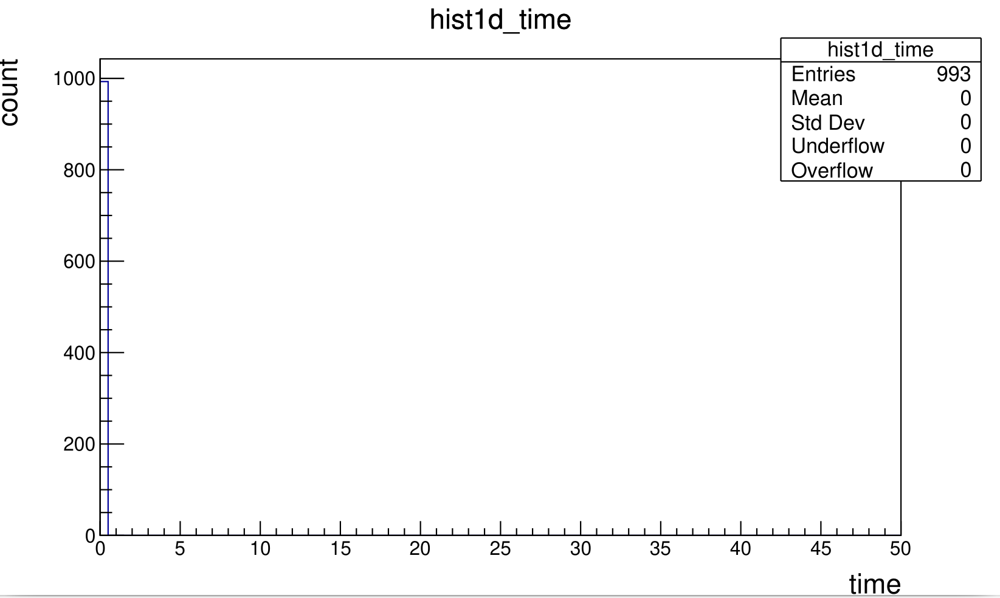
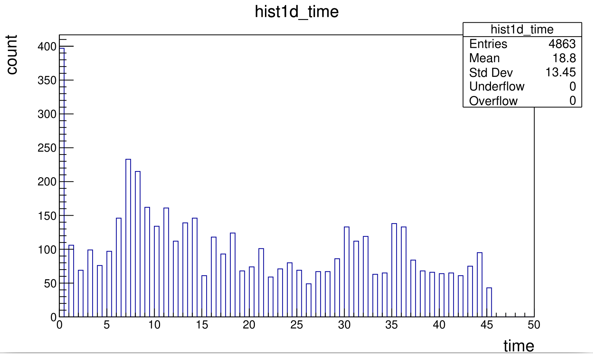
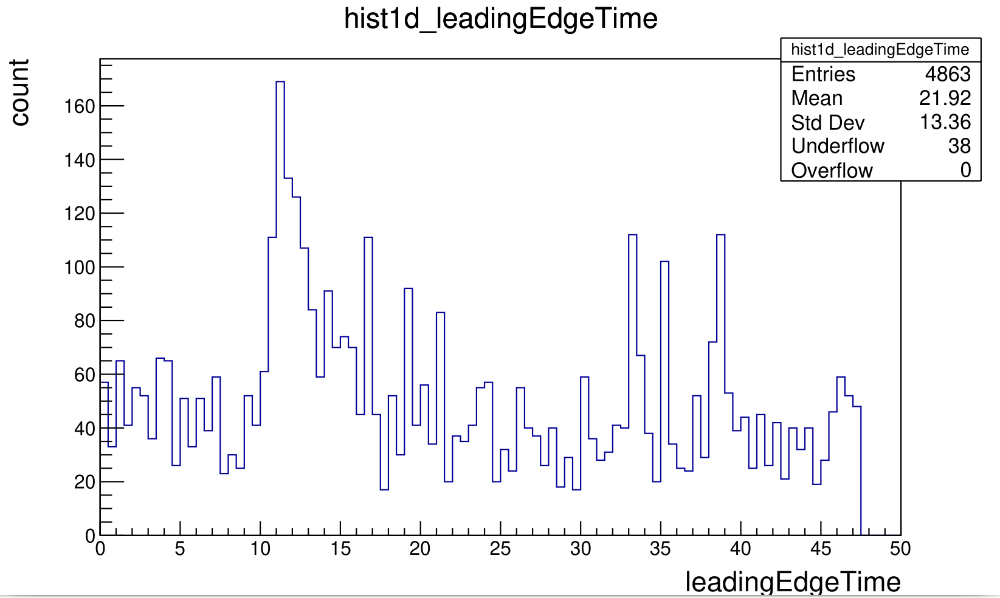
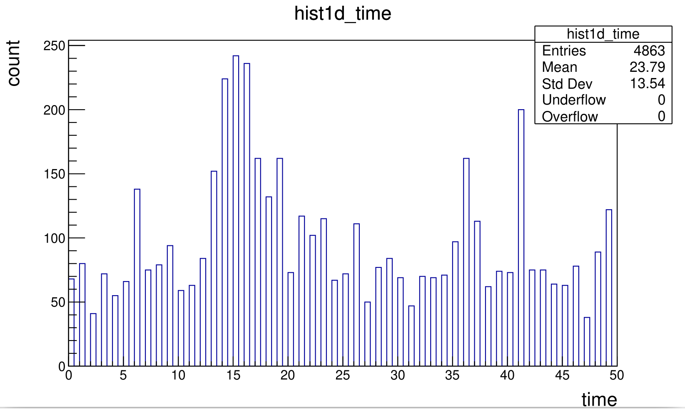
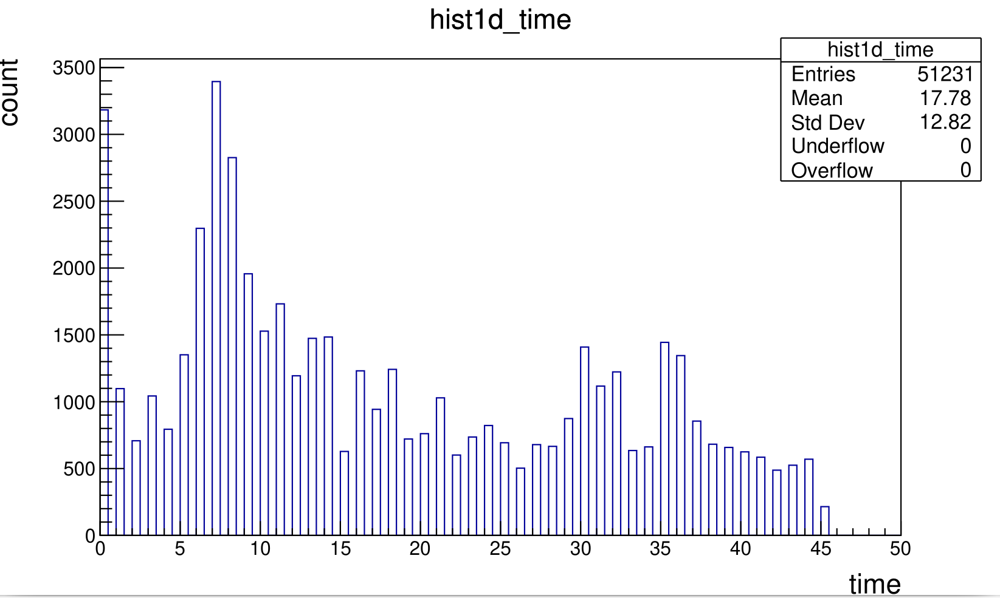
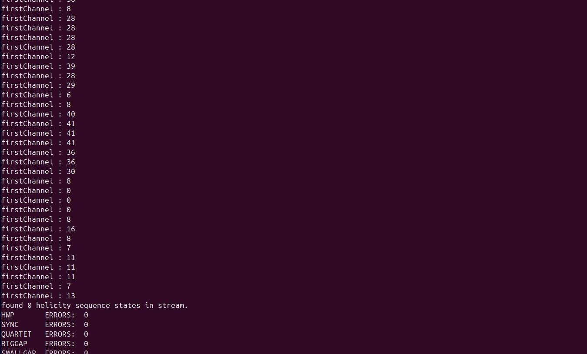
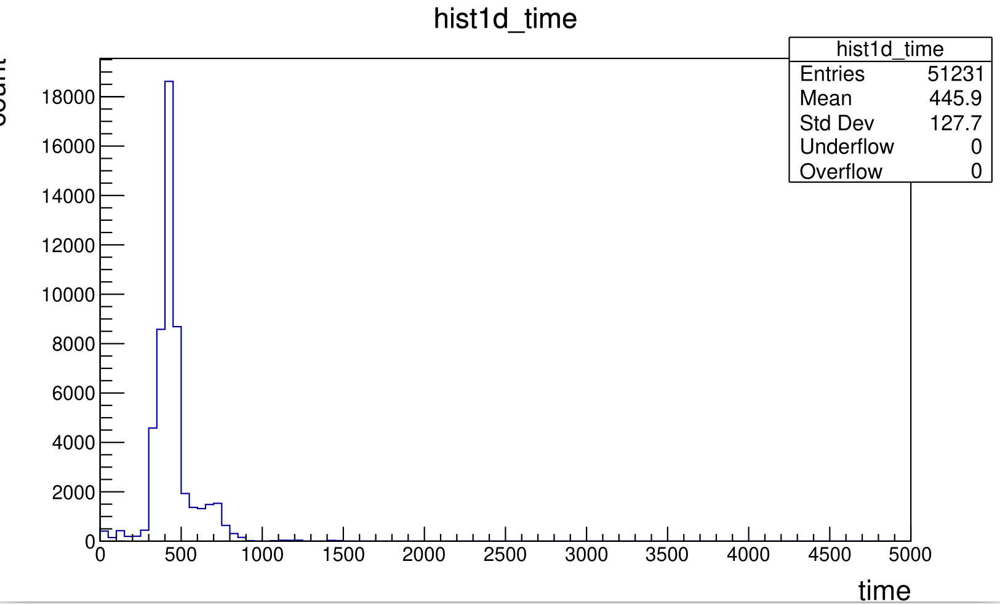
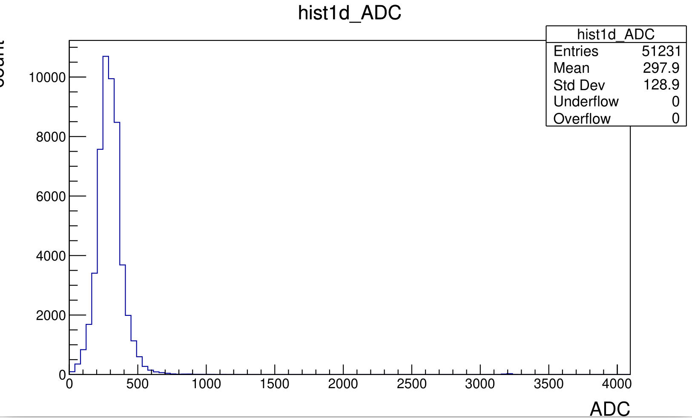
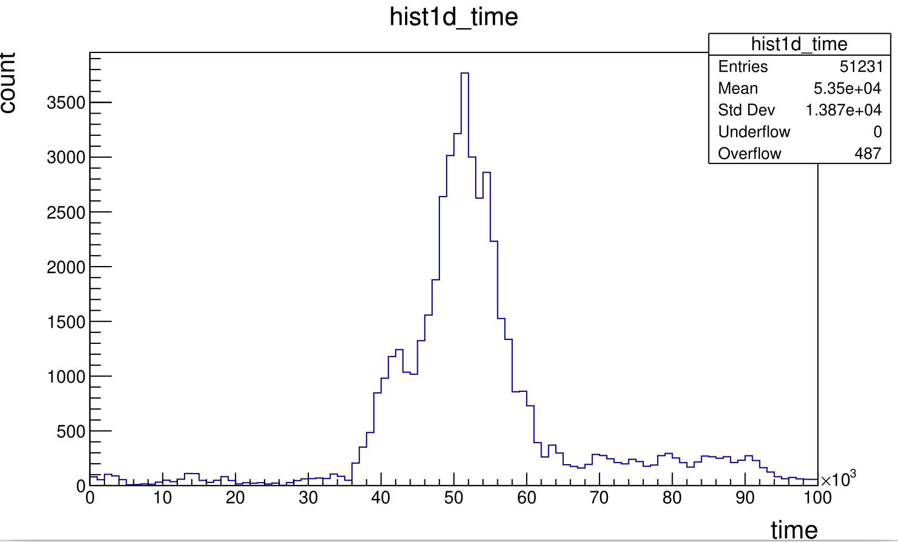

# DATE → 25-03-29

### (25-03-29 12:01:22) ModeAHDC functional
I loooked at the run 21110 with **ZS=1 && ZStyp=0**. The run is small but we can see that the first channel time distribution is always 0.

### (25-03-29 11:44:32) ModeAHDC functional
Simple note. Run 21162 is **ZS=1 && ZStyp=1**

### (25-03-29 11:37:50) ModeAHDC fonctionnal
Here is plot of the **AHDC:::wf time** which store the first channel time of the AHDC pulse.

### (25-03-29 05:41:36) ModeAHDC updated
Here is the associated **leadingEdgeTime**

### (25-03-29 05:34:46) ModeAHDC updated
All time quantity are perfectly translated by the first channel time. Here is a distribution of the **timeMax**.

### (25-03-29 05:09:33) firstChannel issue FIXED
As suspected, the time was overwritten. We were still using the MVTFitter. Now let's do a pull request.

### (25-03-29 04:50:45) firstChannel issue
Here are the link [fitPulses](https://github.com/ftouchte/coatjava/blob/d6a37ac68a81dcbe83ef0bb7cd3865a61c3a4d5d/common-tools/clas-detector/src/main/java/org/jlab/detector/decode/DetectorEventDecoder.java#L162) and [dataList](https://github.com/ftouchte/coatjava/blob/d6a37ac68a81dcbe83ef0bb7cd3865a61c3a4d5d/common-tools/clas-detector/src/main/java/org/jlab/detector/decode/CLASDecoder4.java#L141).

### (25-03-29 04:48:11) firstChannel issue
I think I just find the error. What we call firstChannel seems to be modified in the method fitPulses() of DetectorEventDecoder. It is strange but we are still using the MVTFitter. To correct that I propose to comment the relevant bloc of code. Line 171

### (25-03-29 04:09:37) Time from Bonus12
At the stage of the CodaEventDecoder, the `firstChannel` has reasonable values.

### (25-03-29 03:50:55) Time from Bonus12
Here is the time (the first channel from DREAM manual) distribution. It is very strange, look like an ADC distribution. Probably not, I suspect this time to be modifed before reaching this stage. So I will debug like in old times, i.e do some println()...

### (25-03-29 03:37:23) Time from Bonus12
Corresponding distribution of ADC before the correction I wanted to do. Really look like the time distribution :-(

### (25-03-29 03:24:38) Time from Bonus12
Now I think to modify the code to retrieve the first channel.

### (25-03-29 03:21:58) Time from Bonus12
Raw data, no modifications. Simple plot. **Run 21162** over 20k events

