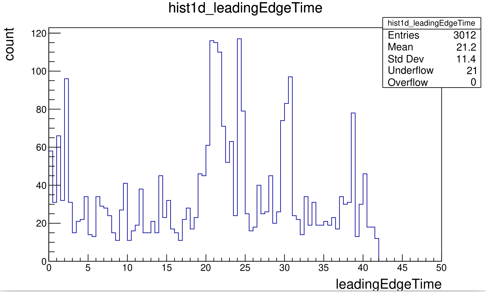
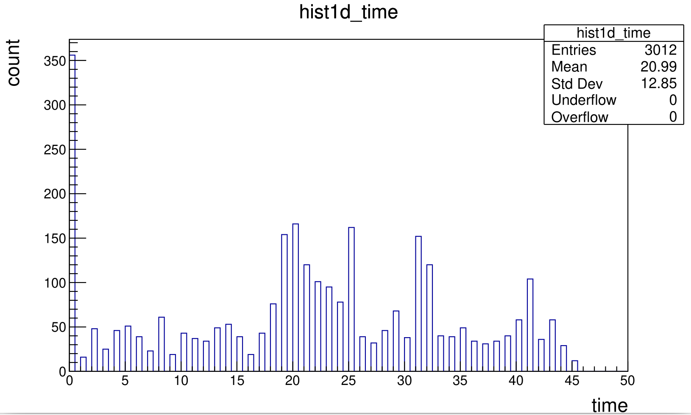

# DATE → 25-03-30

### (25-03-30 08:33:10) LeadingEdgeTime in run 21242 
AHDC::adc --> leadingEdgeTime  
 

### (25-03-30 08:31:24) First channel time in run 21242 
AHDC::wf --> time 
 

### (25-03-30 08:28:55) File decoded 
The file are decoded and available in local (run 21236, 21241, 21242) 

### (25-03-30 07:41:05) jcache run 21236, 21241, 21242 
These runs remain to be cp and decoded. Goal : test the new ModeAHDC and the first channel time. 

