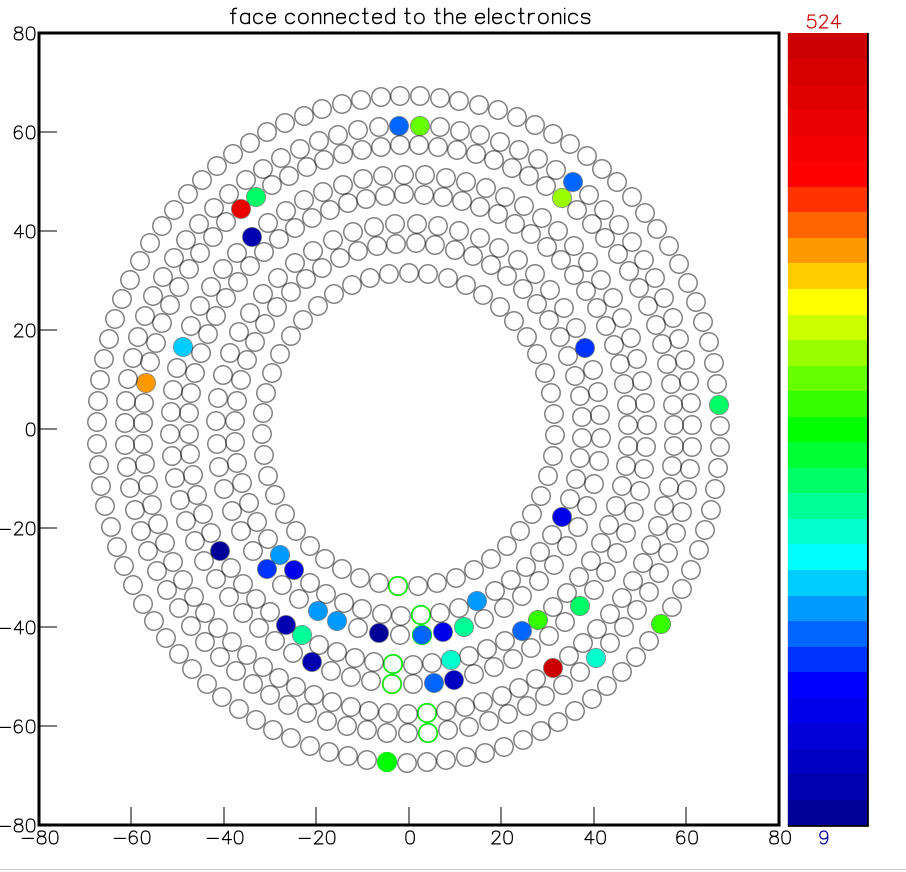
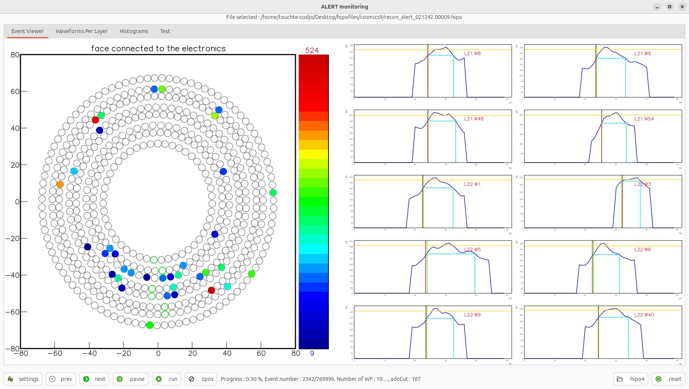

# DATE → 25-03-31

### (25-03-31 11:39:33) Update of waveform display 
Specific view in AHDC, Run 21242.00009 evt 2342. 
 

### (25-03-31 11:39:15) Update of waveform display 
Now we use the decoding output from coatjava to display waveform in the event display of AMON 
 

