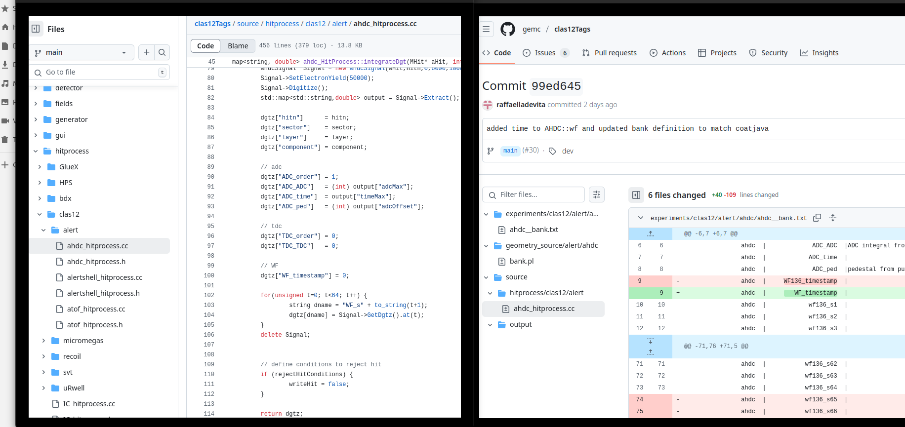
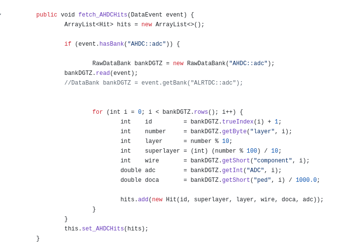
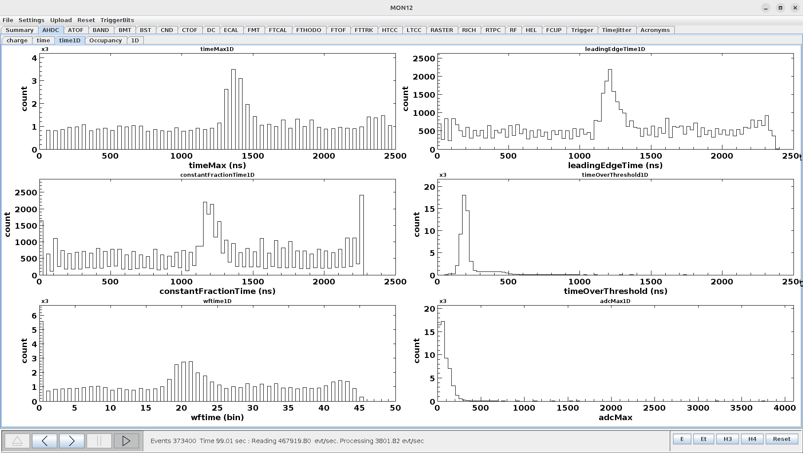
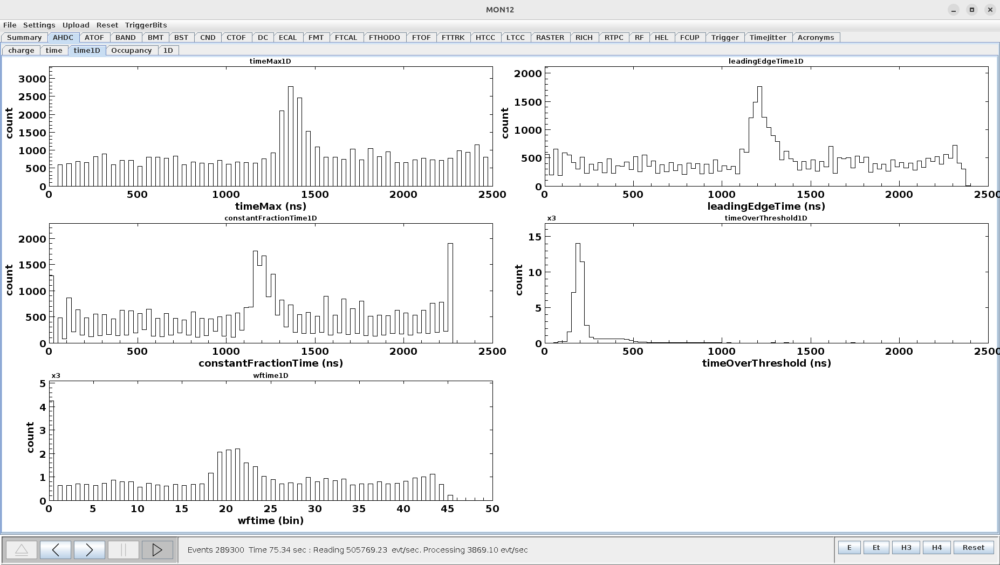
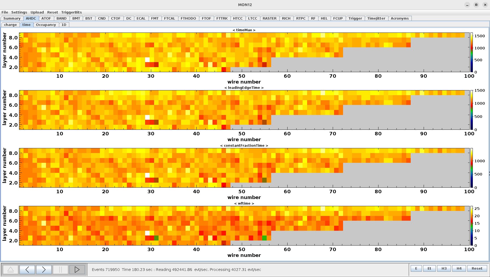
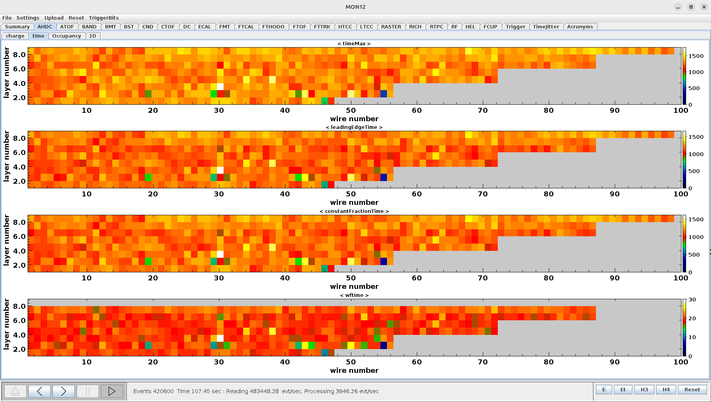
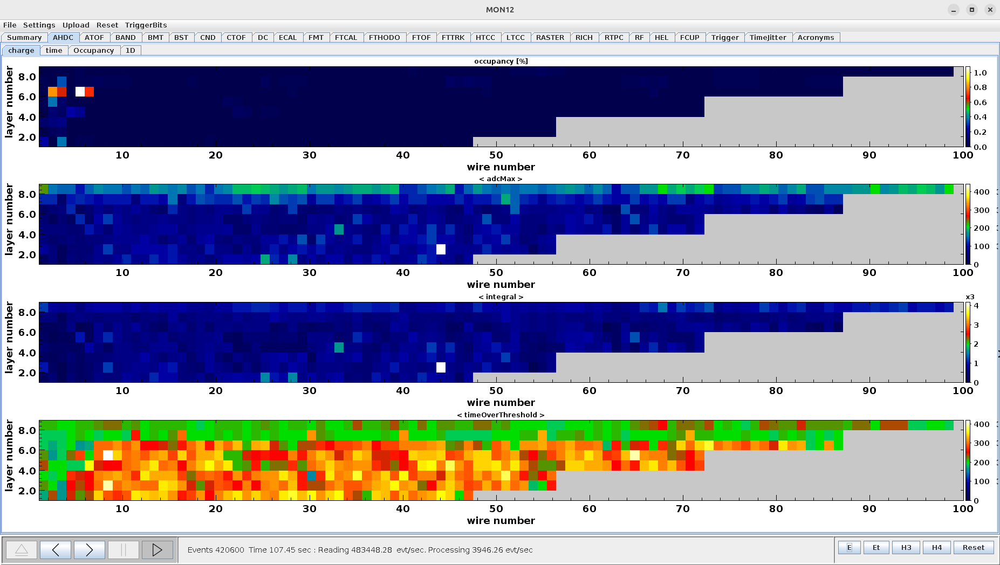

# DATE → 25-04-02

### (25-04-02 15:55:53) clas12Tags/(gemc)/source updated 
No need to update gemc by reducing the number of samples, a commit made by Raffaella already use coatjava notation in gemc. [Link](https://github.com/gemc/clas12Tags/commit/99ed6456a5ac78c42fc16e91d1f8f6073a191b84#diff-c1d9822b22590fb7f13fd8fc5b435b9dcc68e1a028a0eb855c927dbe4f7d6766). 
 

### (25-04-02 15:08:46) Implement the doca in reconstruction, t0, time2distance, protection 
Until now, the **doca** is obsiouly wrong. We need to use the **t0** and apply a **time2distance** to the corrected code. We also need to distinguish real data and simulation data.
 

### (25-04-02 11:51:17) Add adcMax hist in time1D tab of mon12 
Fix count issue (e.g ToT) and add adcMax hist. Run 21042 
 

### (25-04-02 11:29:16) Add new tab in mon12 for 1D time histograms 
Add 1D histograms for timeMax, leadingEdgeTime, constantFractionTime, timeOverThreshold, wftime. Run 21042 
 

### (25-04-02 10:40:58) Add a 2D hist for wf::time in mon12 
Issue fixed. The cut on the last layer has been changed. Run 21042 
 

### (25-04-02 10:29:02) Add a 2D hist for wf::time in mon12 
The first channel time, AHDC::wf --> time is now plotted in the AHDC time tab. Run 21042. We can notice an issue. The layer 8 is not filled. This is due to a cut made during the last pull request, I guess. 
 

### (25-04-02 10:26:03) Move ToT in charge tab of mon12 
Because the timeOverThreshold is related to the charge, i.e adcMax or integral. Run 21042 
 

### (25-04-02 09:09:03) Connection to ifarm changed 
Connection to the ifarm changed. Now, you are using a new pin for the double authentification. Guess what ? 

