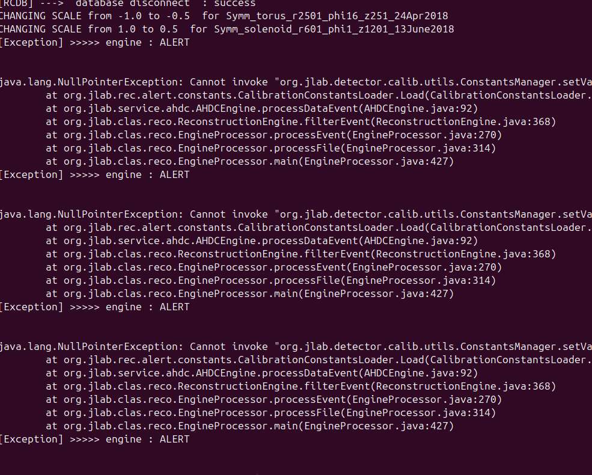
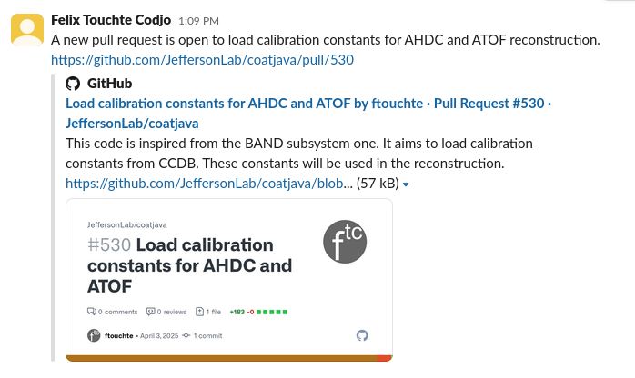
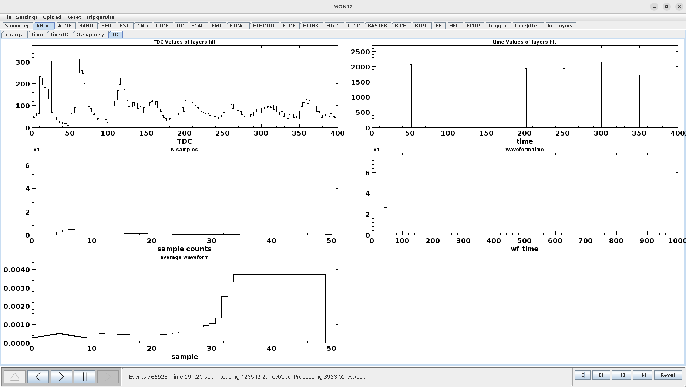
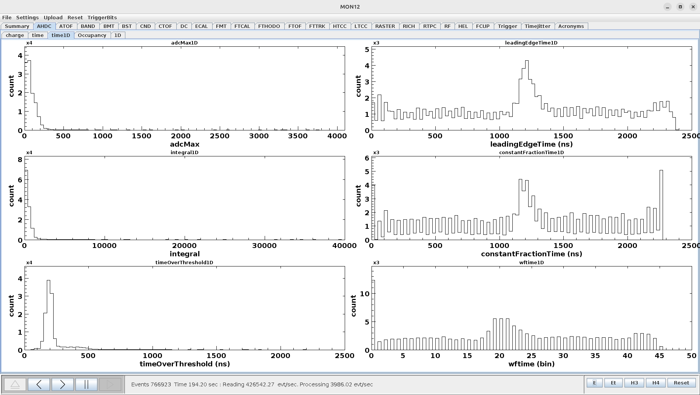

# DATE → 25-04-03

### (25-04-03 18:25:30) Try to load CCDB tables 
Here is a screeshot of the error 
 

### (25-04-03 15:38:44) Implement time2distance 
The implementation of the time to distance in coatjava is ongoing. Already done :
- Modification the AHDC::Hits banks
    - I added time = leadingEdgeTime - t0
    - Now, doca refers to the time from time2distance calibration
    - residual refers to distance from time2distance calibration minus the distance of closest approach computed at the Kalman Filter stage   

### (25-04-03 15:37:19) PR approved 
The PR for the constant calibration loading has been approved. Compilation OK ! Now, need to check the execution on decoded files. 

### (25-04-03 14:02:22) PR open 
A new pull resquest is open to load calibration constants for AHDC and ATOF reconstruction. 
 

### (25-04-03 09:22:09) Deal with overlap in mon12 
Some histograms in **time1D** are also presents in **1D**. But those of **1D** are not well scaled. I prefer to conserve those of **time1D**. This needs to be improved in my PR or later. 
 

### (25-04-03 09:19:41) Update mon12 
Delete timeMax histogram and add integral histogram in the **time1D** tab of mon12/AHDC. The histograms have also been reorganized. 
 

