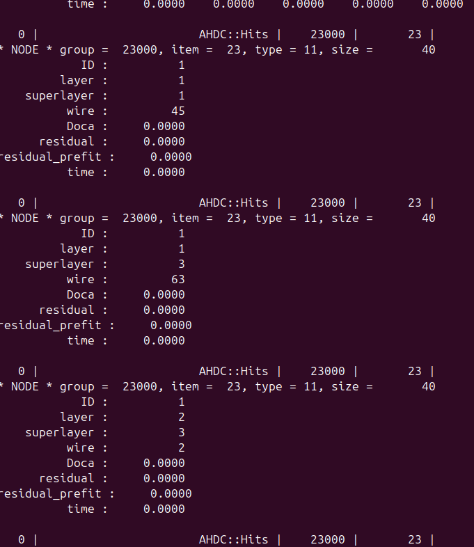
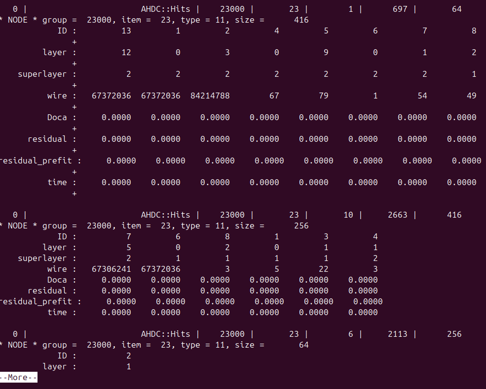

# DATE → 25-04-04

### (25-04-04 13:44:03) Reconstruction is executing 
Issue with AHDC::Hits --> wire fixed. The numbers are reasonable now. I needed to tell hipo-utils that the bank definition has changed or re-decode the evio files with the new bank definition. 
 

### (25-04-04 11:05:22) CCDB for ALERT are successfully loaded. 
The timeOffsets's error was due to a wrong key value. In the AHDCEngine, I also needed to specify yes or not, the reconstruction requires constants. 
 

