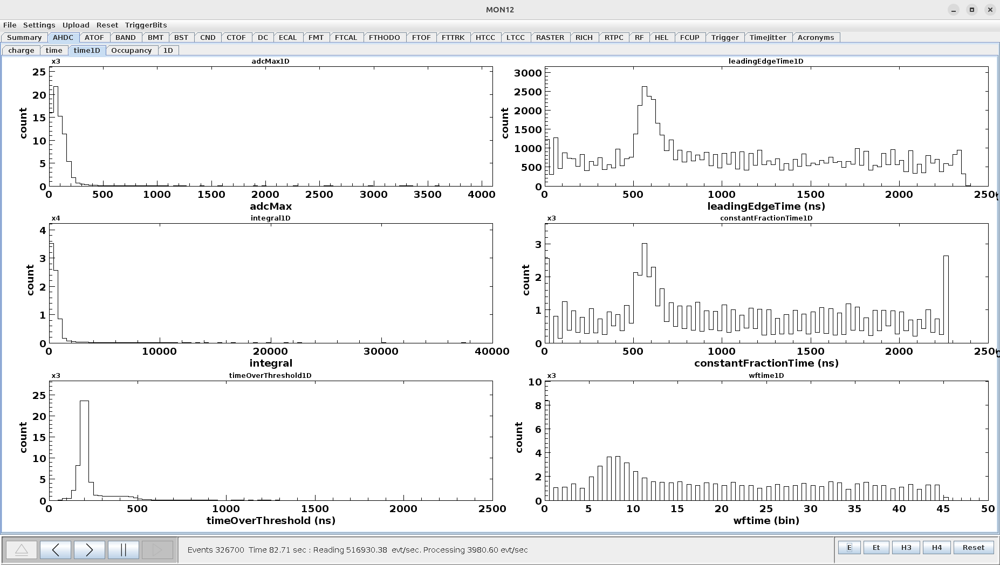
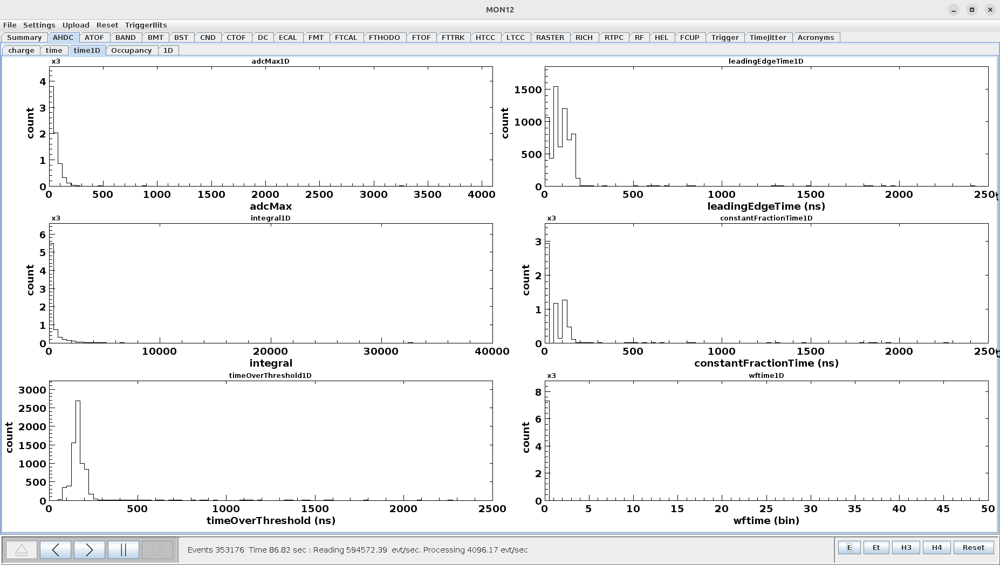
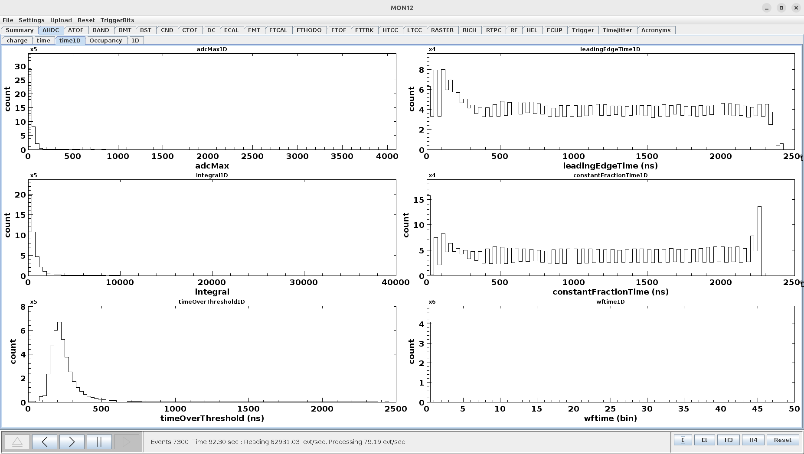
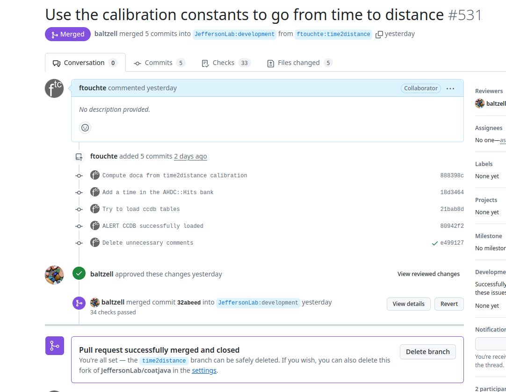

# DATE → 25-04-05

### (25-04-05 19:24:09) Study of ZS effect, case ZS=1 && Zstyp=1 
Run 21183, case with zero suppress type 1 
 

### (25-04-05 19:17:41) Study of ZS effect, case ZS=1 && Zstyp=0 
Run 21175, case with zero suppress type 0 
 

### (25-04-05 19:14:06) Study of ZS effect, case ZS=0 
Run 21123, case without zero suppress. 
 

### (25-04-05 18:49:30) PR approved (t2d implemented) 
This PR has been approved yesterday. I just notice that, for the case of the ATOF, the key_value may not be the best one. I need to know the range of each sector, layer, component for the ATOF. 
 

