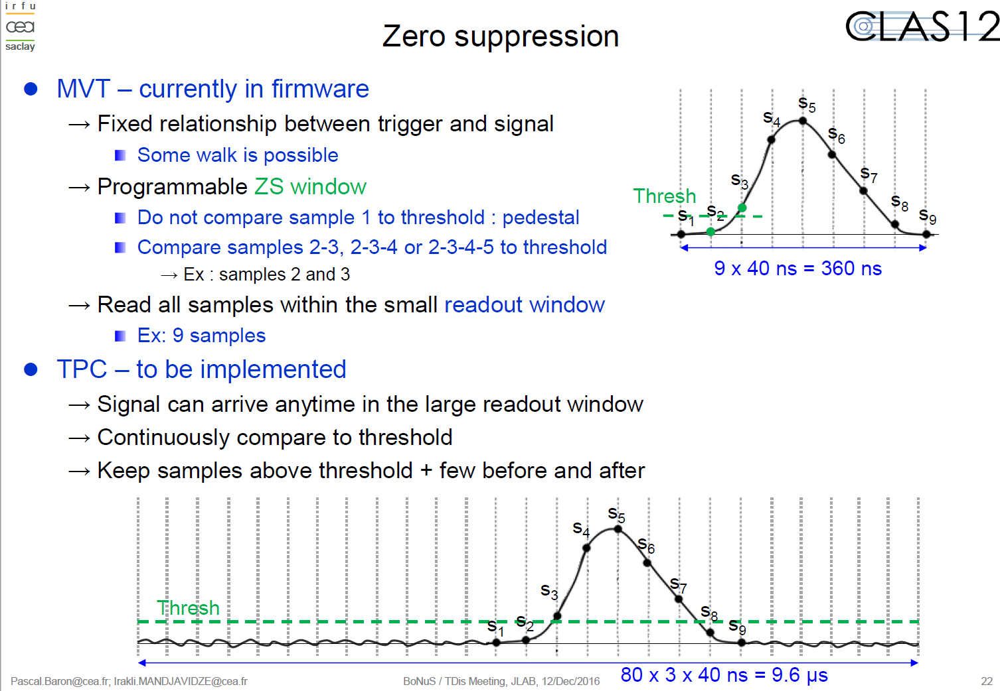

# DATE → 25-04-05

### (25-04-05 19:48:30) Study of the zero suppress effect 
The previous logs show the consistency of the **wftime** with the different mode of ZS. The first channel (== wftime) refers to the time of the first sample (expressed in term of bin number) according this reference.
 

### (25-04-05 19:24:09) Study of ZS effect, case ZS=1 && Zstyp=1 
Run 21183, case with zero suppress type 1. Here the wftime varies between 0 and 49. 
 

### (25-04-05 19:17:41) Study of ZS effect, case ZS=1 && Zstyp=0 
Run 21175, case with zero suppress type 0. Here the wftime is always 0.
 

### (25-04-05 19:14:06) Study of ZS effect, case ZS=0 
Run 21123, case without zero suppress. Here the wftime is always 0.
 

### (25-04-05 18:49:30) PR approved (t2d implemented) 
This PR has been approved yesterday. I just notice that, for the case of the ATOF, the key_value may not be the best one. I need to know the range of each sector, layer, component for the ATOF. 
 

