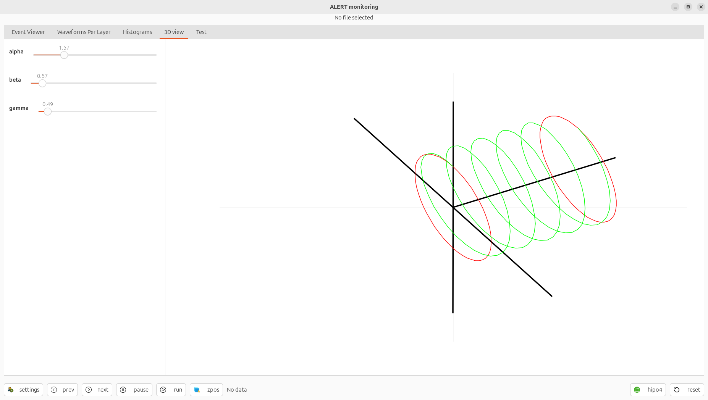

# DATE → 25-04-06

### (25-04-06 22:40:08) ATOF::tdc order 
Run 21171 
 

### (25-04-06 22:39:48) ATOF::tdc component 
Run 21171 
 

### (25-04-06 22:39:31) ATOF::tdc layer 
Run 21171 
 

### (25-04-06 22:38:55) ATOF::tdc sector 
Run 21171 
 

### (25-04-06 22:27:58) ATOF numbering 
Definition of the sector, layer, component and order for the ATOF 
 

### (25-04-06 17:33:50) 3D view in AMON 
Fisrt implementation of a 3D view in AMON 
 

