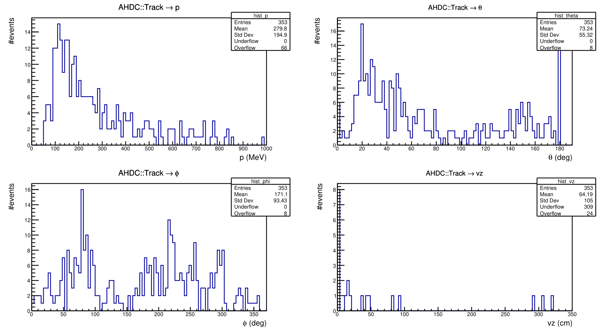
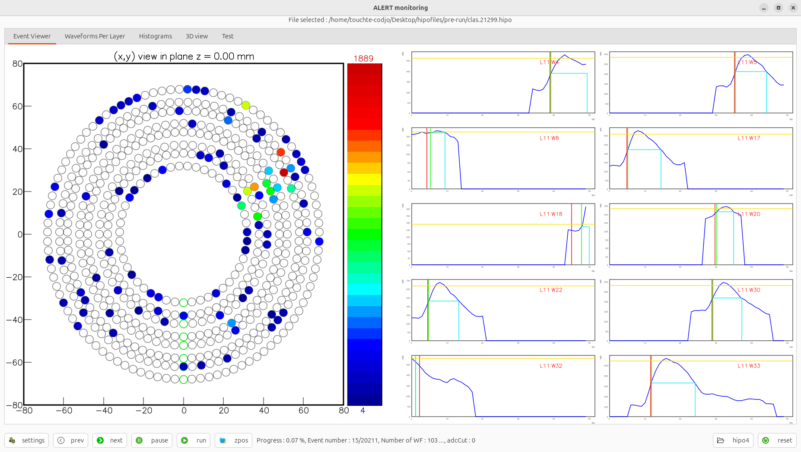

# DATE → 25-04-07

### (25-04-07 15:17:48) Reconstructed data 
Example of the AHDC::Track bank for the run 21317.00010. We removed some hits that do not satify these cuts [PR #540](https://github.com/JeffersonLab/coatjava/pull/540) 
 

### (25-04-07 02:14:56) CCDB for ATOF 
I created a new branch check/atof-ccdb, I started to modify it. I got some good error when I used recon-util. In some cas, the order id is not accessible, I need to redefine a new key value 

### (25-04-07 01:27:37) Commissionning 
Is a track ? 
 

