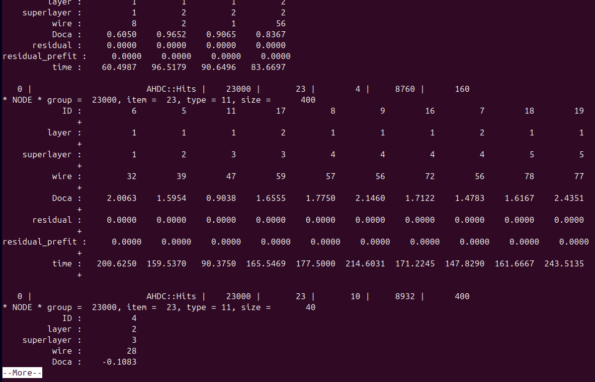
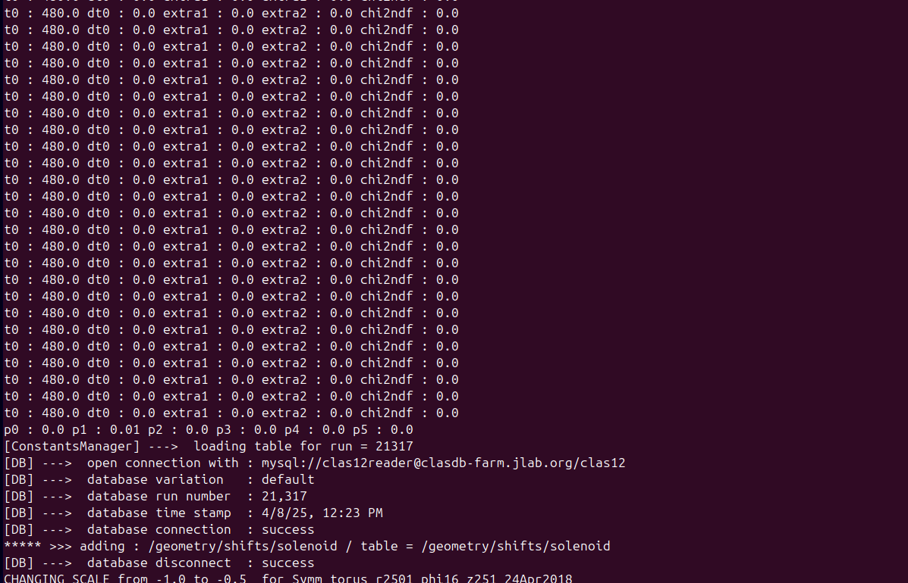
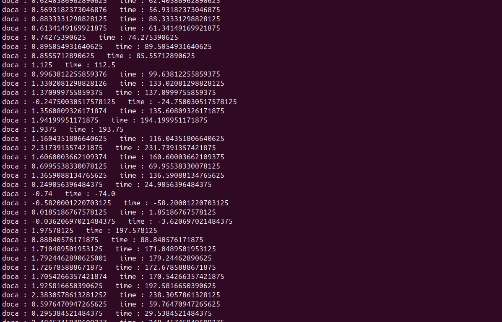
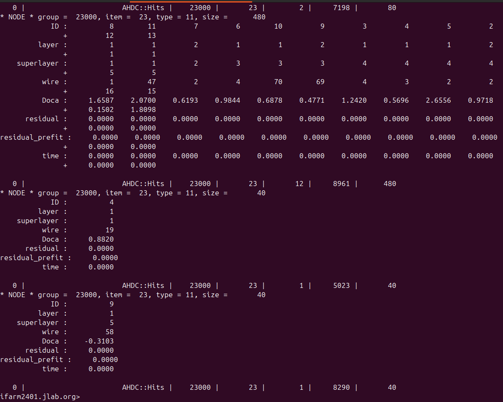

# DATE → 25-04-08

### (25-04-08 15:47:00) AHDC HitReader issue fixed 
I add to modify the rec/ahdc/Banks/RecoBankWriter.java. The time attribut is now filled. 
 

### (25-04-08 12:35:14) AHDC CCDB 
The AHDC CCDB are well read 
 

### (25-04-08 12:38:54) AHDC HitReader 
The doca and the time are normally computed. 
 

### (25-04-08 12:33:18) AHDC HitReader 
In the AHDC::Hits bank, the **time** is not filled. I assume the KF Hit masks the Hit from HitReader. **ISSUE TO BE FIXED !!!**
 

