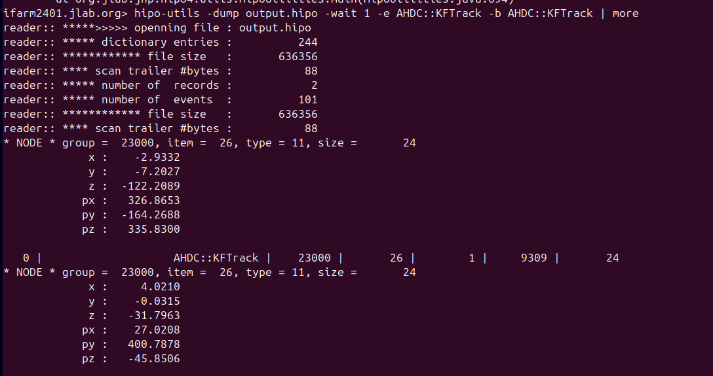
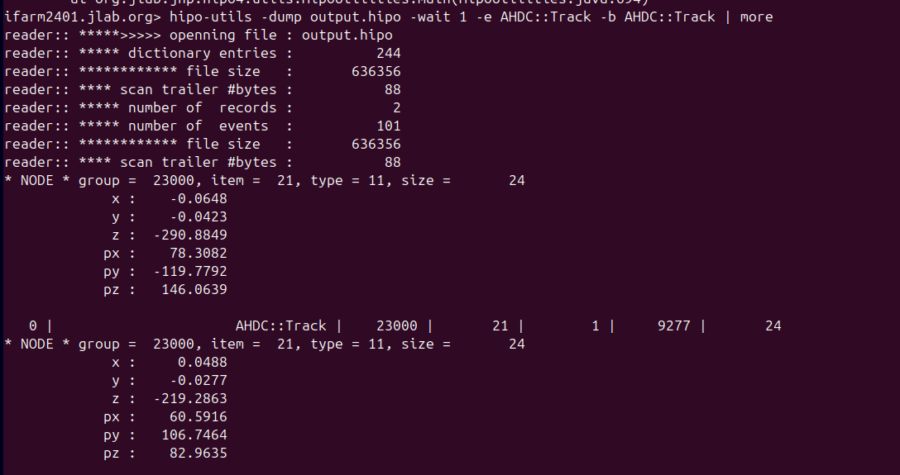
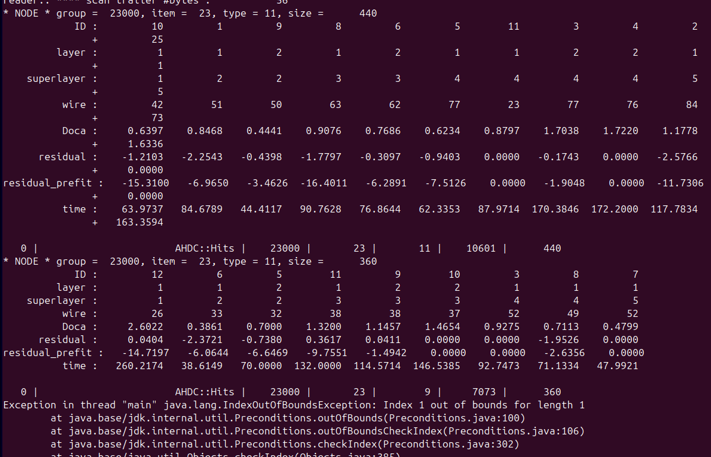

# DATE → 25-04-08

### (25-04-08 17:23:09) State of AHDC::KFTrack 
Only contains x, y, z, px, py, pz. Need to add more information such as : deposited energy, track id (also in AHDC::Hits), p_drift, chi2, sum of residuals... 
 

### (25-04-08 17:22:55) State of AHDC::Track 
Only contains x, y, z, px, py, pz. Need to add more information such as : deposited energy, track id (also in AHDC::Hits), p_drift, chi2, sum of residuals... 
 

### (25-04-08 15:53:59) AHDC::KFTrack is filled 
I thought we add an issue with the two definition of Hit (ahdc.Hit and "KF.Hit"), but it's not. That's why the **residual** is filled. Useful command line :
```bash
hipo-utils -dump output5.hipo -e AHDC::KFTrack -b AHDC::Hits -wait 1 | more
```

 

### (25-04-08 15:47:00) AHDC HitReader issue fixed 
I add to modify the rec/ahdc/Banks/RecoBankWriter.java. The time attribut is now filled. 
 

### (25-04-08 12:35:14) AHDC CCDB 
The AHDC CCDB are well read 
 

### (25-04-08 12:38:54) AHDC HitReader 
The doca and the time are normally computed. 
 

### (25-04-08 12:33:18) AHDC HitReader 
In the AHDC::Hits bank, the **time** is not filled. I assume the KF Hit masks the Hit from HitReader. **ISSUE TO BE FIXED !!!**
 


