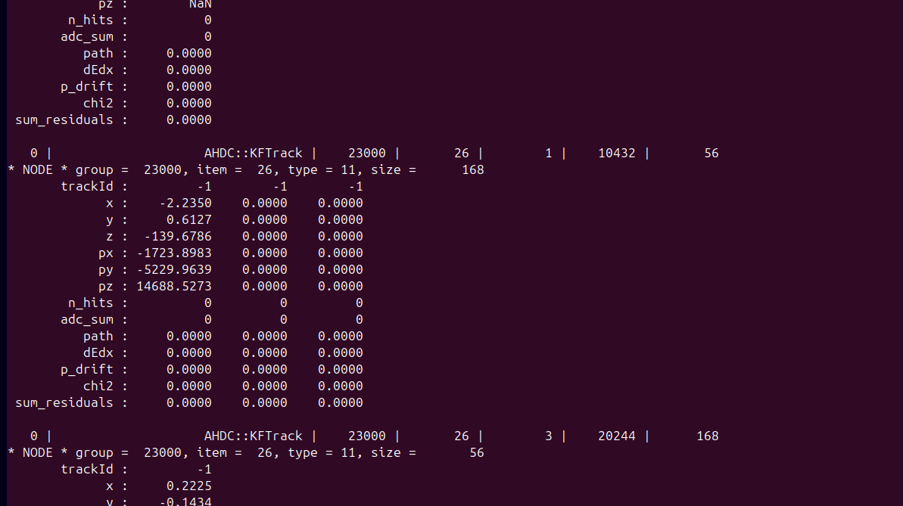
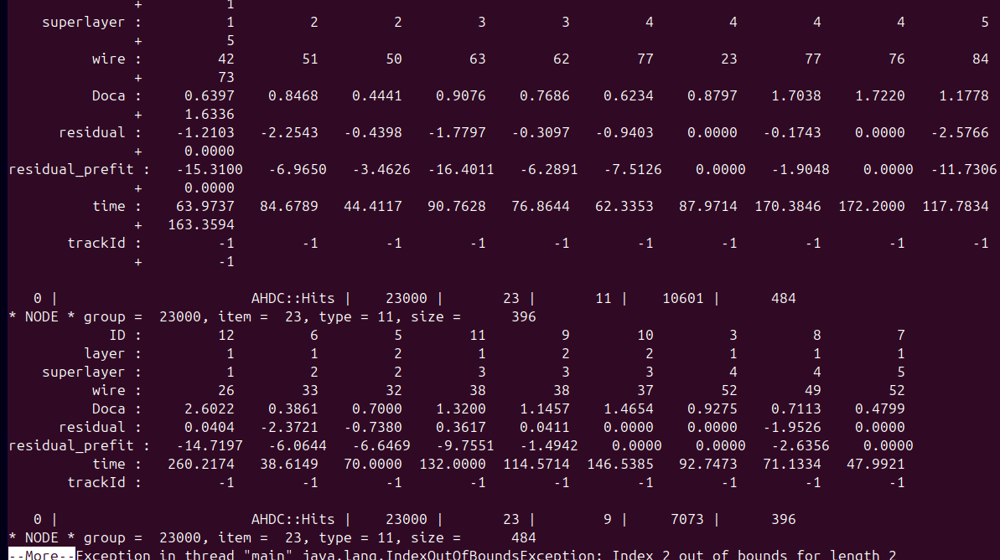
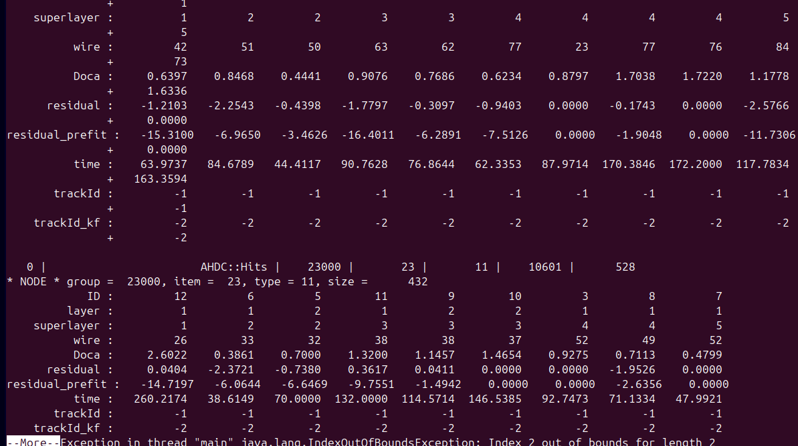
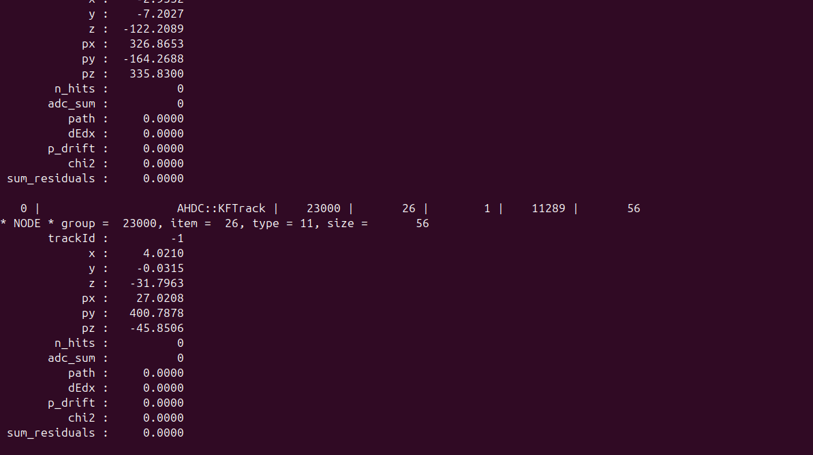
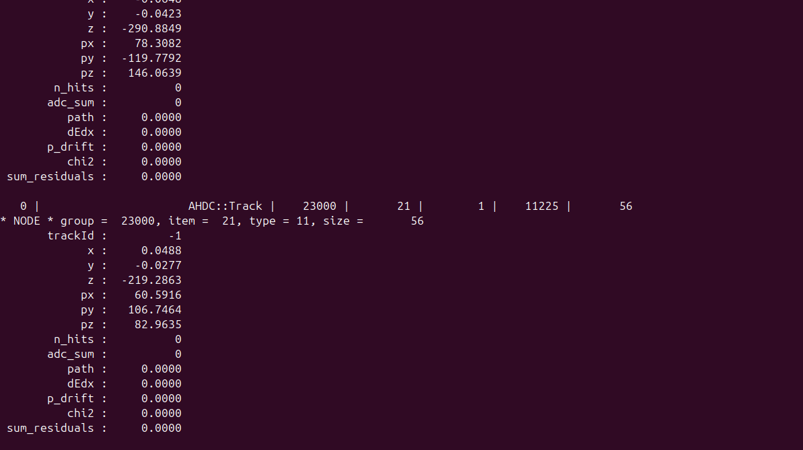
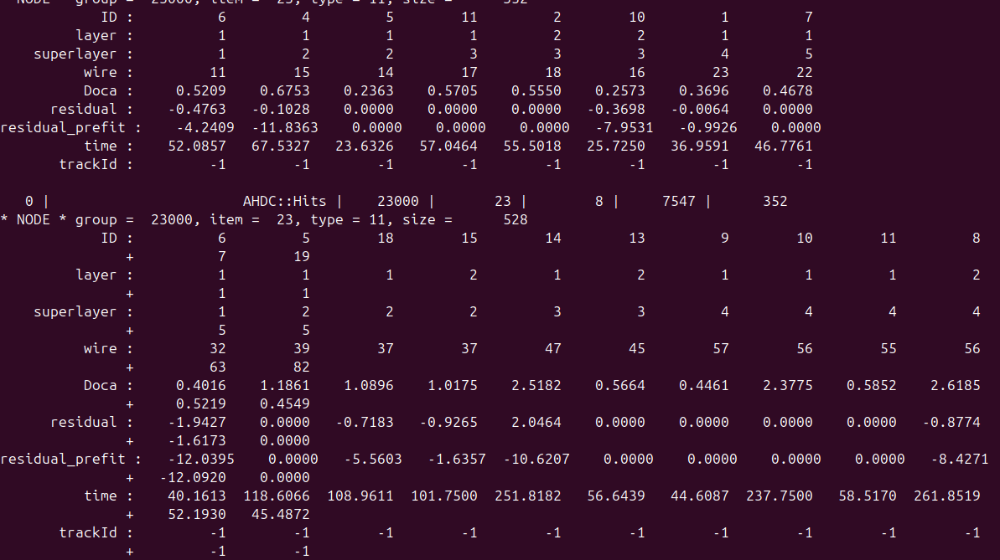

# DATE → 25-04-09

### (25-04-09 15:46:09) Only one track is computed in AHDC::KFTrack 
This an issue !
 

### (25-04-09 15:06:56) Remove redundant track id in AHDC::Hits 
The track id is the same for Track and KFTrack. So track_id_kf has been removed. The KF only recomputes some parameters of an existing Track. 
 

### (25-04-09 15:01:26) Add a specific track id for KFTrack in AHDC::Hits 
Try two track id for Track and KFTrack 
 

### (25-04-09 12:56:20) Update AHDC::KFTrack structure 
Do trackId in Track and KFTrack can be differents ? 
 

### (25-04-09 12:56:04) Update AHDC::Track structure 
Do trackId in Track and KFTrack can be differents ? 
 

### (25-04-09 12:54:39) Update AHDC::Hits structure 
I wonder if we need a trackId for each Track and KFTrack ? 
 

