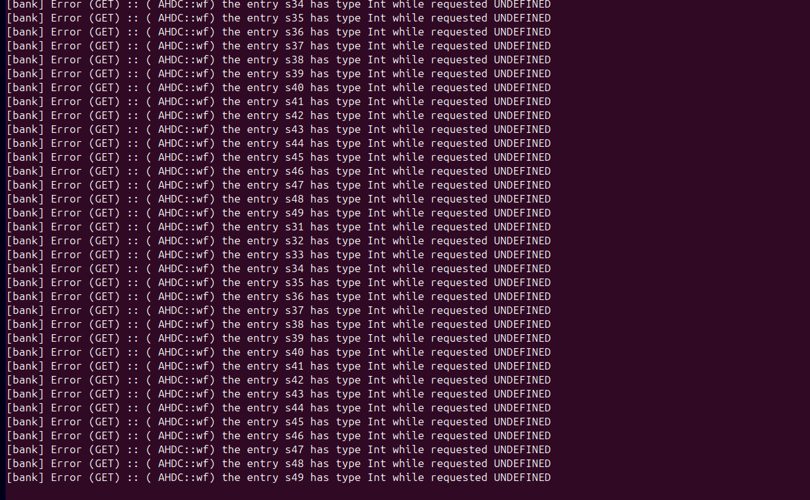
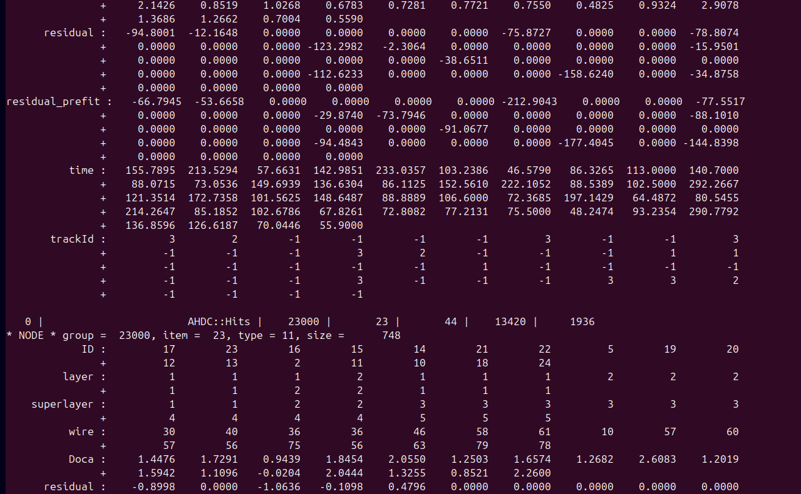

# DATE → 25-04-10

### (25-04-10 15:38:26) mon12 update 
Now I have the lead on the modifications that should be done for the AHDC in mon12. The number of bins was hard coded in coatjava; so each time it changes, it should be modified in mon12. It will be better to load it from a ccdb. 
 

### (25-04-10 13:30:49) Extend AHDC tracks 
The banks AHDC::Track, AHDC::KFTrack and AHDC::Hits have been extended. The pull request has also been accpeted. Note that, some tracks can share the same hit. In that sense, the last track overwrite the track id in the AHDC::Hits bank if it shares some hits with the previous track. 1) A solution could be to duplicate the AHDC hits each time a new track is found. 2) Or, as we don't have most of 10 hits (for example), we can multiply the track id by the same multiple (e.g 137 if the this hit is associated to the track number 1, 3 and 7). The issue with this last option is that we will not be able to store other quantities such as sum_adc, sum_resisuals or chi2. 3) We can create a AHDC::KFHits bank that is well fitted to store this track id. But at end, it rejoin the point 1). 
 

