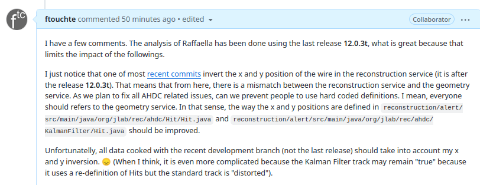

# DATE → 25-04-12

### (25-04-12 22:09:16) Mismatch between geometry and reconstruction service for AHDC 
I'm the responsible of this mismatch. :-( 

That must be the occasion to prevent people to use hard coded definitions but only refer to the related service, in that case, the geometry one. 
 

