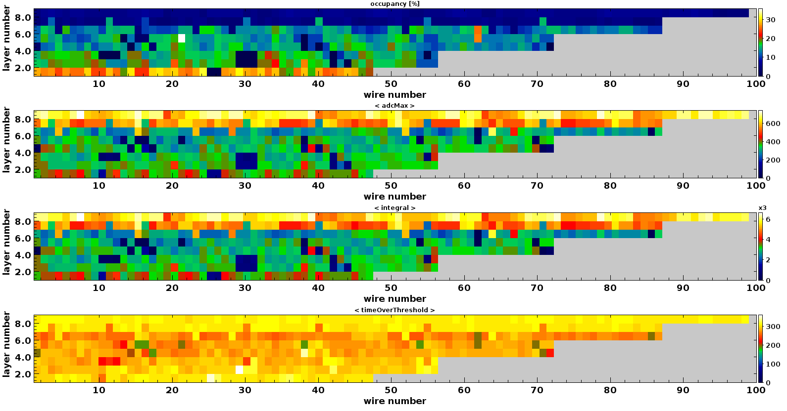

# DATE → 25-04-14

### (25-04-14 16:54:23) Target purge 
It has to be done once per day by the AHDC/target expert in coordination with the Run Coordinator. Due to daq issue, I will probably need to end the recent run, "stop" the beam... Today, around 3pm, I did it with the help of Sangbaek and Bryan. We set the system in auto mode. 

### (25-04-14 16:51:00) ALERT bank names nomalized 
Renormalization of ALERT bank is effective. The associated PR has be appreoved and merged in the development branch. [link](https://github.com/JeffersonLab/coatjava/pull/558) 

### (25-04-14 16:47:44) Bin numbering fixed in mon12 
A pull request has been submitted to fix the bin numbering issue in AHDC 2D histograms. Waiting for approval. [link](https://github.com/JeffersonLab/mon12/pull/99) 

### (25-04-14 10:46:16) Fix bin numbering in mon12 for AHDC 
The x axis range from 1 to 100 with 100 bins. The number of bins is not good at all. In this case, we only need 99 (the maximum number of wires on a layer). 
 

