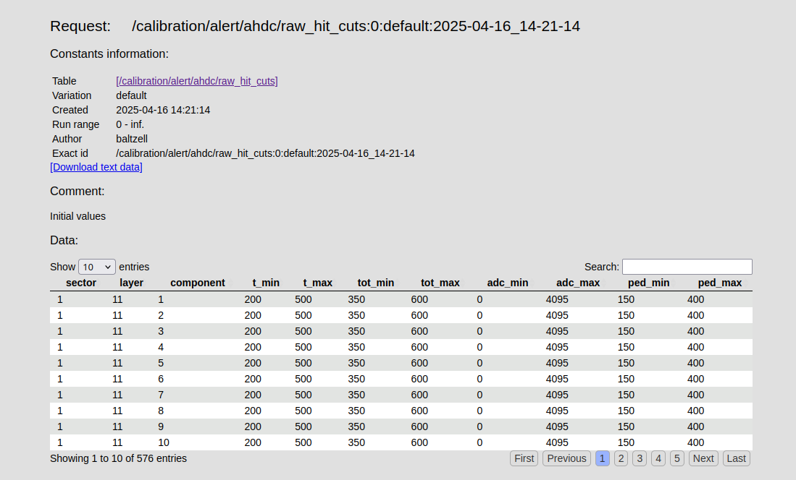
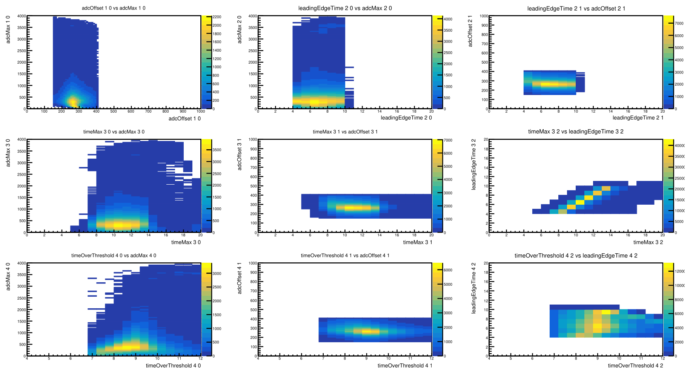
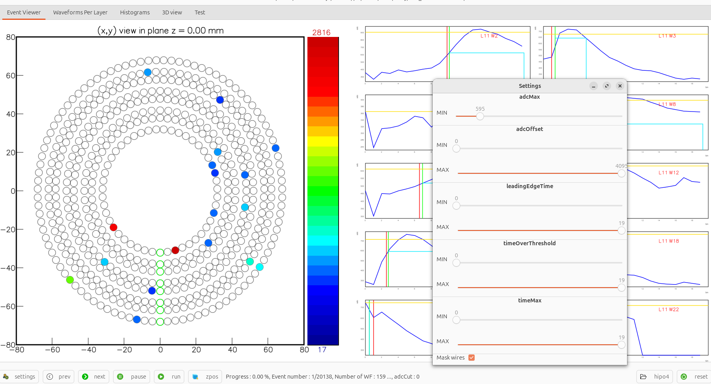

# DATE → 25-04-16

### (25-04-16 17:49:20) PR GitHub CI failed 
The error is related to a ccdb connection. I should be fixed later automatically. 

### (25-04-16 17:37:41) Load row hit cuts of AHDC from CCDB 
Pull request submitted [#572](https://github.com/JeffersonLab/coatjava/pull/572) 

### (25-04-16 16:09:23) CCDB for raw hit cuts 
Nathan created a new CCDB table. [link](https://clasweb.jlab.org/cgi-bin/ccdb/show_request?request=/calibration/alert/ahdc/raw_hit_cuts:0:default:2025-04-16_14-21-14) 
 

### (25-04-16 16:05:28) Correlation between cuts in amon 
This study aimed to determine good cuts to reduce the AHDC occupancy at the reconstrcution stage, in HitReader. We plan to load these cut parameters from a CCDB. 
 

### (25-04-16 16:02:21) Add adcOffset cut in amon 
I have also added a check button, to decide wether or not, we should hide the wires/hits of a given even that don't satify th cuts. 
 

