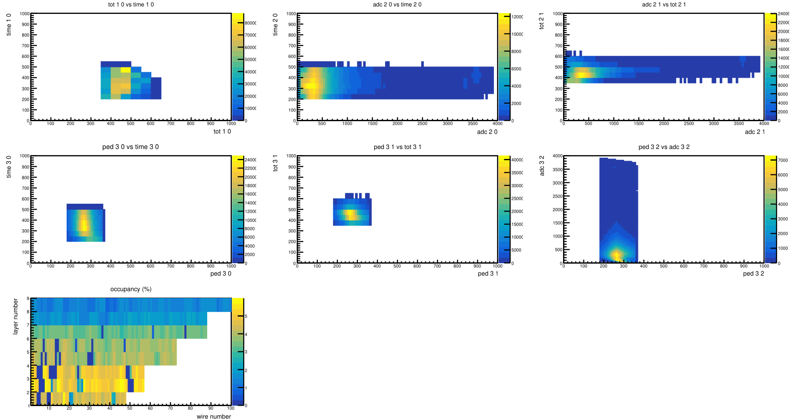

# DATE → 25-04-18

### (25-04-18 13:26:28) AHDC occupancy withcuts 
Run 21494. We add cuts a the stage of the reconstruction (HitReader). The values of these cuts are read from a CCDB, with a sligth change `180 <= ped <= 180`. With these cuts we goes from 60 % to 6 % of occupancy in the first layer of the AHDC. The goal is to maintain a rate of 5 %. Study done over 65k events. 
 

### (25-04-18 13:23:20) AHDC occupancy without cuts 
Run 21494. The occupancy in the first layer of AHDC is very high. We need to reduce this number before the reocnstruction. 
 

### (25-04-18 11:43:42) Issue in AHDC::track bank 
We don't want to fit tracks with less that 3 points. That's the reason why we got weird value on px, py, pz : NaN and Infinity. 
 

