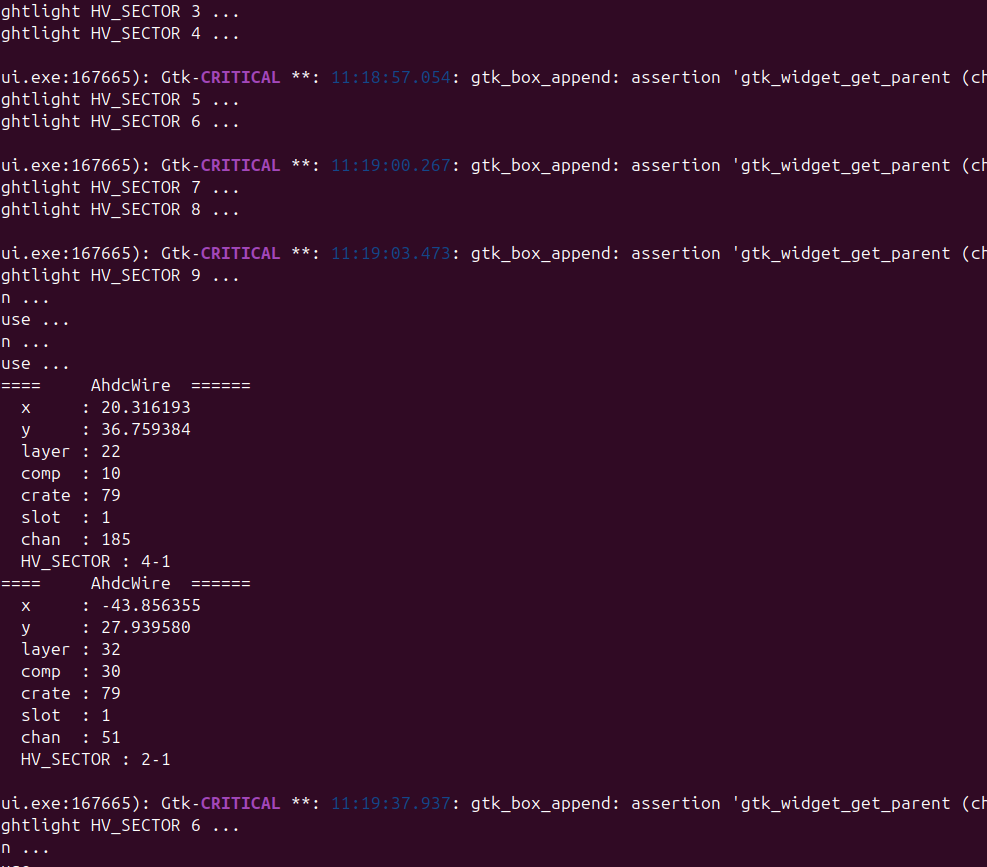
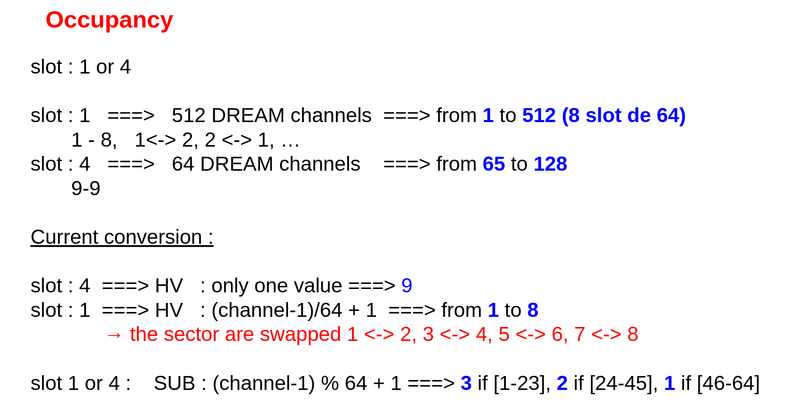
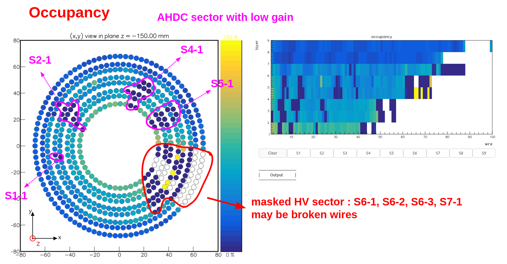
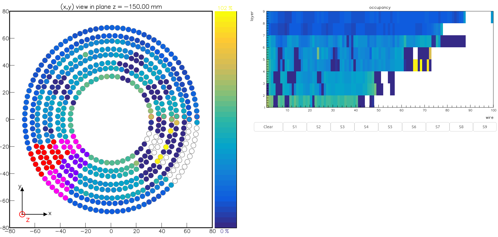

# DATE → 25-04-23

### (25-04-23 19:05:56) Fix widget gestion 
I think the issue comes from the fact that each call to drawOccupancy(), remove columns (and with, no auto widget like TextView_occupancy) 
 

### (25-04-23 18:54:34) Conversion DREAM channel to HV sector 
Current algorithm. Warning: sectors are wapped following 1 <-> 2, 3 <-> 4, 5 <-> 6, 7 <-> 8. Please refer to GitHub. 
 

### (25-04-23 18:49:32) Identify HV sector with low gain in AHDC 
With the help of Nathan, I went down in the Hall B and placed the corresponding HV in new power supply spot. 
 

### (25-04-23 18:44:58) Successfully reper HV sector in amon 
I created in a script, `amon/ressources/mapping`, that generated C++ code, AhdcMapping.h and .cpp, from the AHDC translation table. 
 

