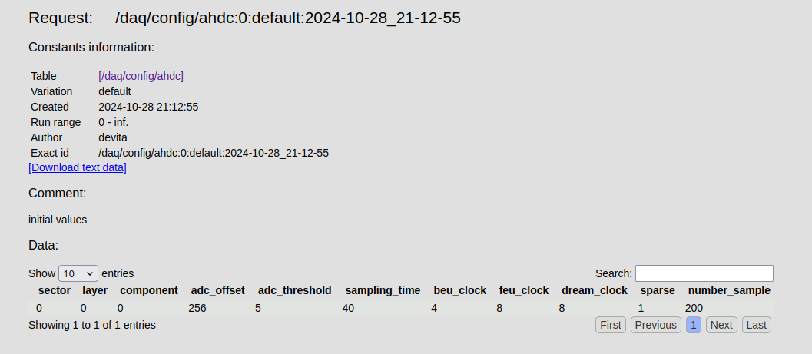

# DATE → 25-07-17

### (25-07-17 22:48:31) To do 
1) Ask Raphaël if we want to do the correction at the decoding level as for the [MVT](https://github.com/ftouchte/coatjava/blob/339ee45018f5bb908208b50b649397f67fba1e90/common-tools/clas-detector/src/main/java/org/jlab/detector/decode/DetectorEventDecoder.java#L171) 

2) Load /daq/config/ahdc from the constant repo of the alert reconstruction ? (depend on action 1) or like MVT in DetectorEventDecoder

3) Read mvt Fitter code to understand the meaning of timestamp, sparseSample, ...

4) Use startTime

### (25-07-17 22:40:17) time resolution and timestamp 
They are calibration constants. Here are some links: 

 [MVT code](https://github.com/ftouchte/coatjava/blob/339ee45018f5bb908208b50b649397f67fba1e90/common-tools/clas-detector/src/main/java/org/jlab/detector/decode/DetectorEventDecoder.java#L175) 

 [/daq/config/ahdc/](https://clasweb.jlab.org/cgi-bin/ccdb/show_request?request=/daq/config/ahdc:0:default:2024-10-28_21-12-55) 
 

### (25-07-17 22:34:09) trigger time is in REC::Event 
I guess we should make the correction in local, during the analysis or in the event builder. 

Link: [https://github.com/JeffersonLab/coatjava/tree/5912ac9f93b1fe5cdb7a72fbb2d370fe7c14ff48/reconstruction/eb](https://github.com/JeffersonLab/coatjava/tree/5912ac9f93b1fe5cdb7a72fbb2d370fe7c14ff48/reconstruction/eb) 

var: startTime

### (25-07-17 18:49:25) separate sidebar in two block 
the label in sidebar-settings is not behaving like expected... 
 

### (25-07-17 16:54:24) Skeleton for plot2data 
 
 

### (25-07-17 15:25:33) Use Gtk::Frame for better appearance 
 
 

### (25-07-17 14:13:00) Simulate clascss log entry taker 
you can use the commands wl-copy and wl-paste. 

e.g: `wl-paste > filename.png` 

### (25-07-17 13:21:29) A track study 
Started yesterday. The path and dEdx variables have been computed by Eric one month ago. dEdx was stored in AHDC::track instead of AHDC::fktrack. This PR should fixed it: [https://github.com/JeffersonLab/coatjava/pull/752](https://github.com/JeffersonLab/coatjava/pull/752)

cf. code in analysis/track.cpp
 

### (25-07-17 13:16:27) Update plot2data 
Done yesterday actually. I used css extension in gtkmm. 
 

