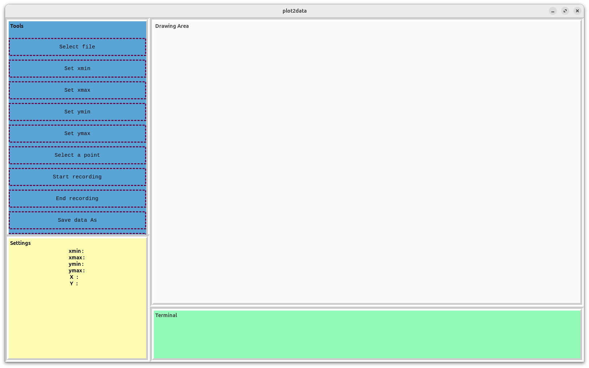
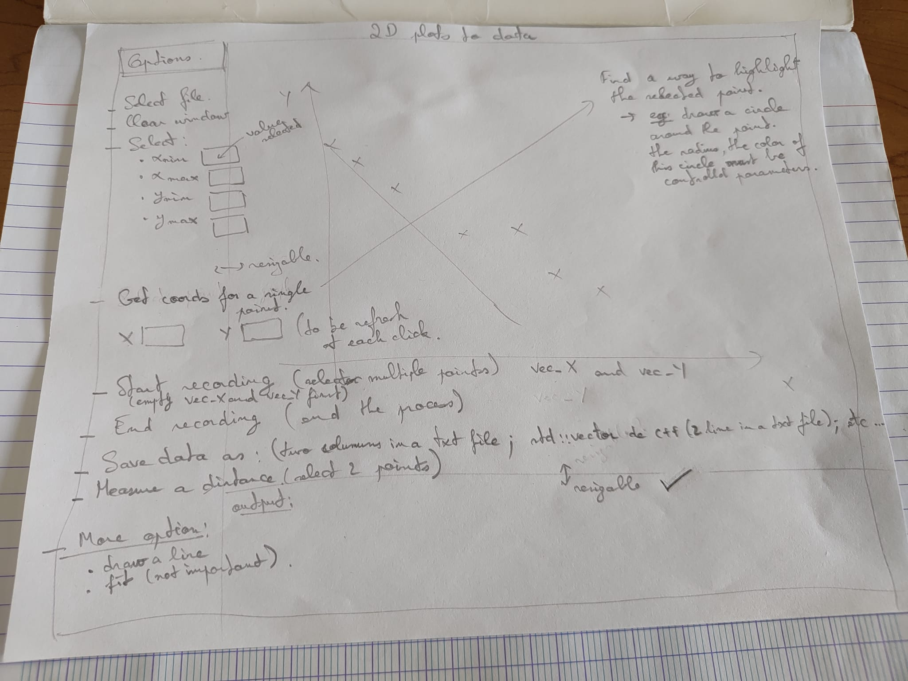
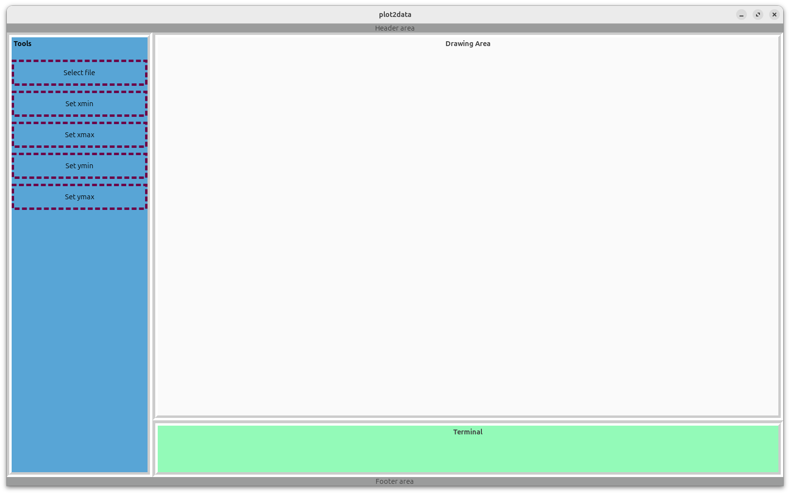

# DATE → 25-07-17

### (25-07-17 18:49:25) separate sidebar in two block 
the label in sidebar-settings is not behaving like expected... 
 

### (25-07-17 16:54:24) Skeleton for plot2data 
 
 

### (25-07-17 15:25:33) Use Gtk::Frame for better appearance 
 
 

### (25-07-17 14:13:00) Simulate clascss log entry taker 
you can use the commands wl-copy and wl-paste. 

e.g: `wl-paste > filename.png` 

### (25-07-17 13:21:29) A track study 
Started yesterday. The path and dEdx variables have been computed by Eric one month ago. dEdx was stored in AHDC::track instead of AHDC::fktrack. This PR should fixed it: [https://github.com/JeffersonLab/coatjava/pull/752](https://github.com/JeffersonLab/coatjava/pull/752)

cf. code in analysis/track.cpp
 

### (25-07-17 13:16:27) Update plot2data 
Done yesterday actually. I used css extension in gtkmm. 
 

