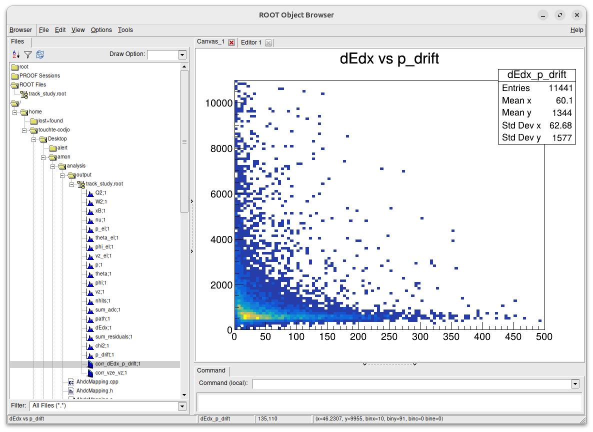
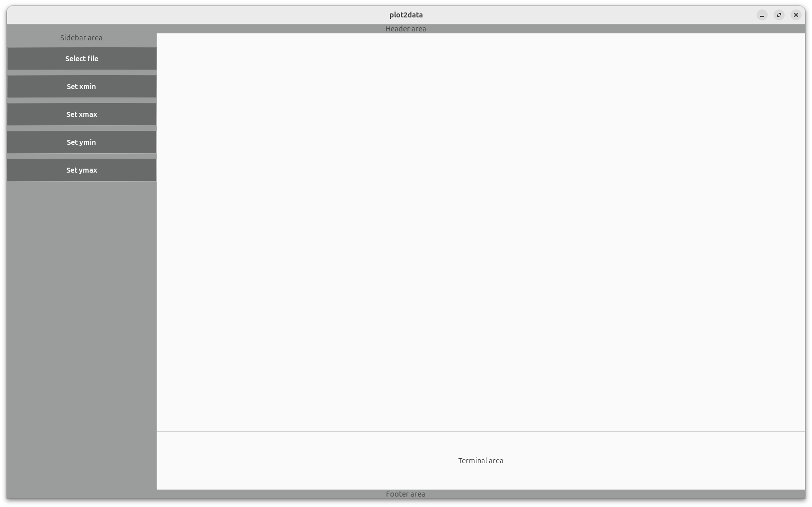

# DATE → 25-07-17

### (25-07-17 13:21:29) A track study 
Started yesterday. The path and dEdx variables have been computed by Eric one month ago. dEdx was stored in AHDC::track instead of AHDC::fktrack. This PR should fixed it: [https://github.com/JeffersonLab/coatjava/pull/752](https://github.com/JeffersonLab/coatjava/pull/752)

cf. code in analysis/track.cpp
 

### (25-07-17 13:16:27) Update plot2data 
Done yesterday actually. I used css extension in gtkmm. 
 

