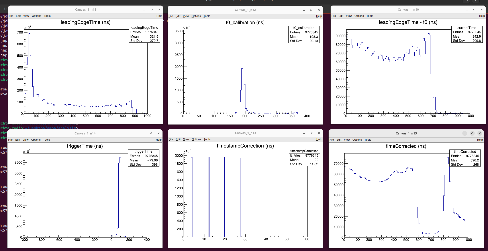
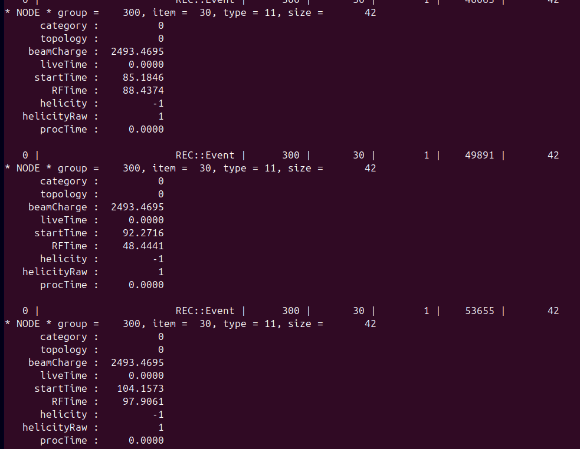
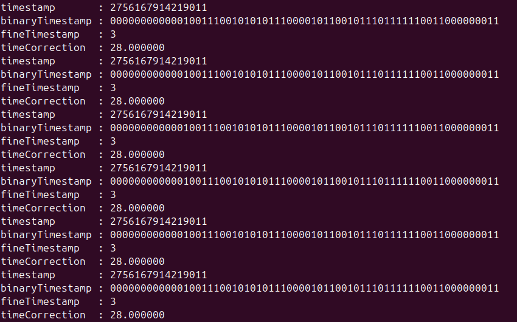
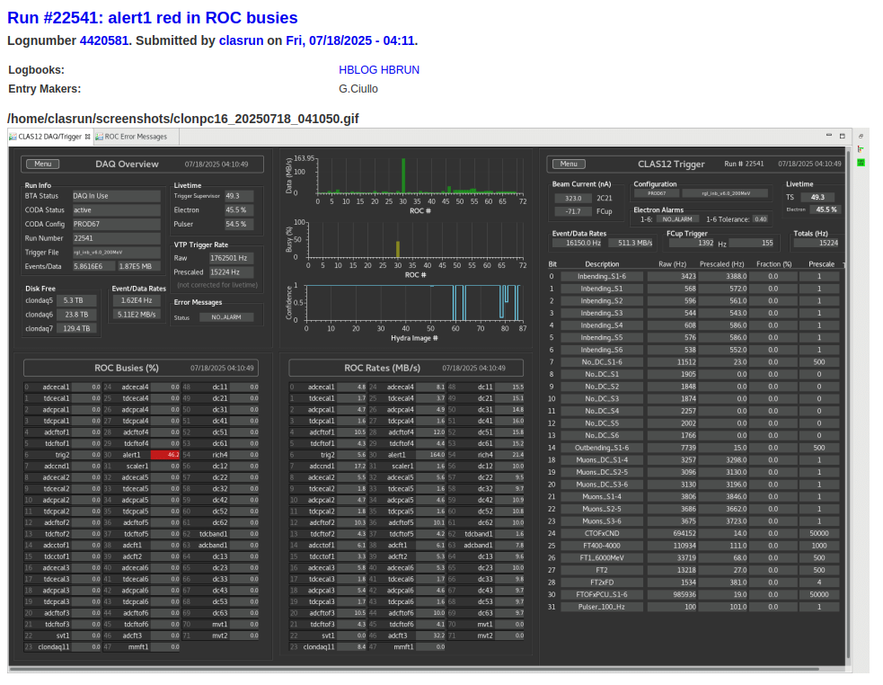

# DATE → 25-07-18

### (25-07-18 17:28:00) Asked Nathan to access the dream_clock variable in ModeAHDC 
... 

### (25-07-18 17:25:20) time correction study 
See amon/analysis/timestamp.cpp: 
 

### (25-07-18 17:24:38) trigger time in REC:::Event 
In run 22435... 
 

### (25-07-18 17:23:47) fineTimeStampCorrection algorithm 
The code has been translated from Java to C++. Typical output: 
 

### (25-07-18 13:55:20) Roc alert1 busy (follow-up) 
Similar issue happened few weeks ago. The last time, it was somehow linked to the Faraday cup. Indeed, when Sergey removed the Faraday cup to the trigger file, the alert1 issue disappeared. [day shift summary](https://logbooks.jlab.org/entry/4413278) 

### (25-07-18 13:50:53) All about timestamp 
1) Variable of [ADCData](https://github.com/ftouchte/coatjava/blob/339ee45018f5bb908208b50b649397f67fba1e90/common-tools/clas-detector/src/main/java/org/jlab/detector/decode/DetectorDataDgtz.java#L174) 

2) timestamp from evio file, [coda](https://github.com/ftouchte/coatjava/blob/339ee45018f5bb908208b50b649397f67fba1e90/common-tools/clas-detector/src/main/java/org/jlab/detector/decode/CodaEventDecoder.java#L768) 

3) timestamp in mvtFitter,  [fit method usage](https://github.com/ftouchte/coatjava/blob/339ee45018f5bb908208b50b649397f67fba1e90/common-tools/clas-detector/src/main/java/org/jlab/detector/decode/DetectorEventDecoder.java#L180), [fit method definition](https://github.com/ftouchte/coatjava/blob/339ee45018f5bb908208b50b649397f67fba1e90/common-tools/clas-detector/src/main/java/org/jlab/detector/decode/MVTFitter.java#L86) 

### (25-07-18 11:49:41) ROC alert1 busy ? 
I started the decoding of the run 22541. I will look at the waveform. 
 

